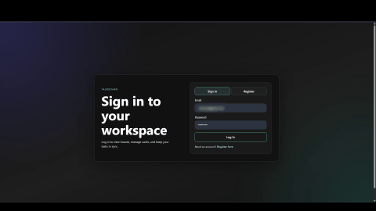

# Project Brief Summary
## Frontend portion of Kanban web application
* Account creation & login functionality
* Board creation and selection for different goals
* Full task card CRUD functionality
* Drag and drop implementation for easily moving cards between column types

 

# Tech Stack
* React
* Vite
* JavaScript
* HTML/CSS

 

# Setup
1) Make sure taskboard backend is set up. This can be found at `https://github.com/eromero21/taskboard-backend-springboot`
2) Uses React with build by Vite so ensure installation of Vite@latest and React
3) `npm run dev` command to startup this project

 

# Stuff I learned
I have learned a lot especially in regards to react component usage and modularizing items so files do not become too congested. There is certainly further room for improvement and I am excited to continue working with the tech stack.